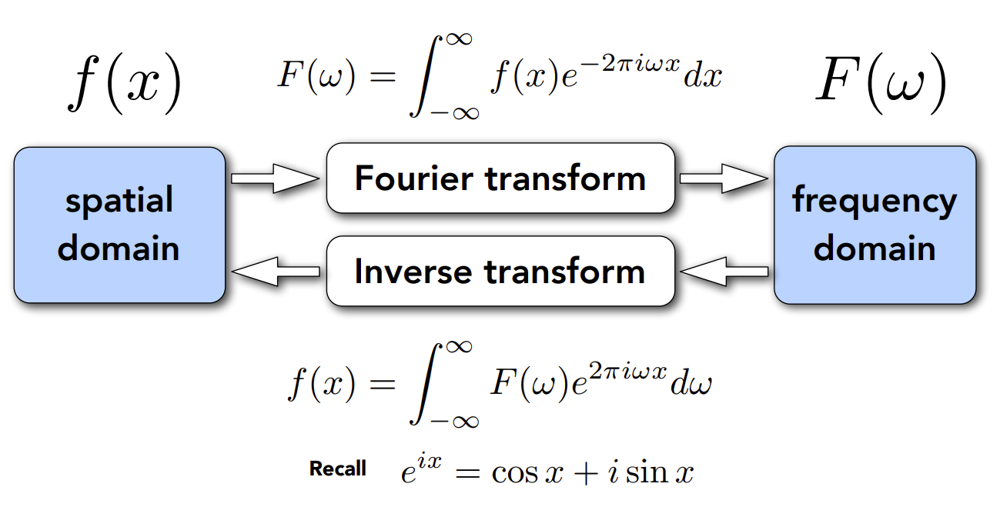
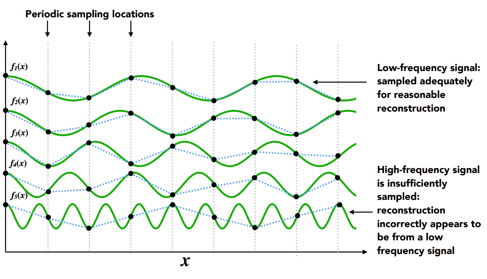
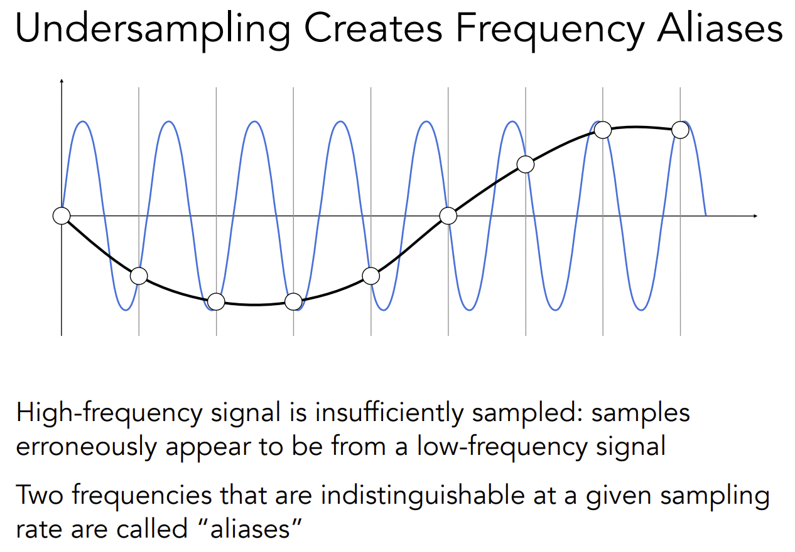

# 光栅化 Rasterization

## 采样 Sample

## 走样 Aliasing

Sample Aliasing(Error / Mistakes / Inacuuracies) in Computer Graphics

- Jaggies 锯齿
- Moire 摩尔纹
- Wagon Wheel Effect 车轮倒转

产生原因：信号是高频连续变换，但采样是低频离散

## 反走样 Anti-Aliasing

Pre-Filter Then Sample

## 模糊走样 Blurred Aliasing

## 频域 Frequency Domain

## 傅里叶级数展开 Fourier Transform

高通滤波——（边缘）

低通滤波——（模糊）

## 卷积定理

空间域中的卷积等于频域中的乘法，反之亦然

- 选项1:
	- 在空间域中通过卷积进行滤波
- 选项2:
	- 变换到频域(傅里叶变换)
	- 乘以卷积核的傅里叶变换
	- 变换回空间域(傅里叶反变换

## MSAA(Multi-Sample AntiAliasing)

## FXAA(Fast Approximate AntiAliasing)

## TAA(Temporal AntiAlasing)
