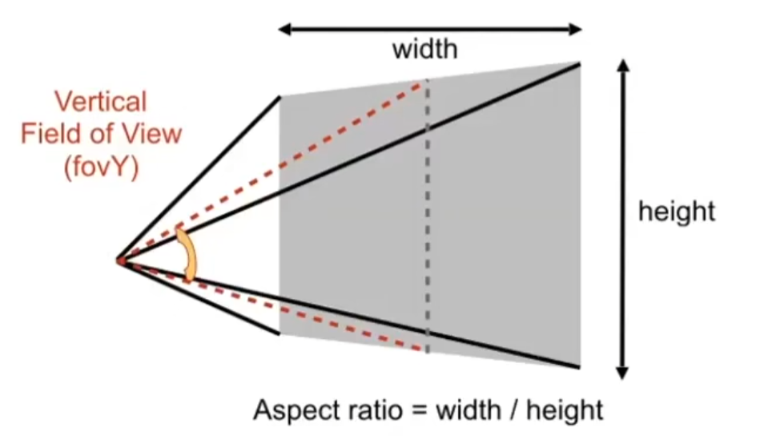
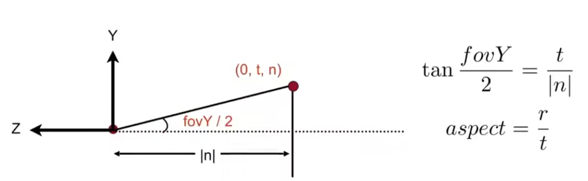

# 变换 Transformation

## 2D Transform

### 不均缩放 Scale(Non-Uniform)

$$
\begin{bmatrix}
x'\\
y'
\end{bmatrix}
=
\begin{bmatrix}
s_x & 0\\
0 & s_y
\end{bmatrix}
\begin{bmatrix}
x\\
y
\end{bmatrix}
$$

#### 反射矩阵 Reflection Matrix

$$
\begin{bmatrix}
x'\\
y'
\end{bmatrix}
=
\begin{bmatrix}
-1 & 0\\
0 & 1
\end{bmatrix}
\begin{bmatrix}
x\\
y
\end{bmatrix}
$$

#### 剪切矩阵/切变矩阵 Shear Matrix

>Hints:
>
>Horizontal shift is 0 at y=0,
>
>Horizontal shift is a at y=1,
>
>Vertical shift is always 0

$$
\begin{bmatrix}
x'\\
y'
\end{bmatrix}
=
\begin{bmatrix}
1 & a\\
0 & 1
\end{bmatrix}
\begin{bmatrix}
x\\
y
\end{bmatrix}
$$

### 旋转 Rotate

>about the origin (0,0),CCW by default
>
>默认绕原点(0,0) 逆时针(CounterClockWise)旋转

$$
R_\theta
=
\begin{bmatrix}
\cos\theta & -\sin\theta\\
\sin\theta & \cos\theta
\end{bmatrix}
$$

对于任意一个旋转必定满足于
$$
\begin{bmatrix}
x'\\
y'
\end{bmatrix}
=
\begin{bmatrix}
a & b\\
c & d
\end{bmatrix}
\begin{bmatrix}
x\\
y
\end{bmatrix}
$$

并且有以下几个特殊点

$$
\left\{
\begin{lgathered}
(0,1)\rightarrow(\cos\theta,\sin\theta)\\
(1,0)\rightarrow(-\sin\theta,\cos\theta)
\end{lgathered}
\right.
$$

代入原式解得

$$
\left\{
\begin{lgathered}
a=\cos\theta\\
b=-\sin\theta\\
c=\sin\theta\\
d=\cos\theta
\end{lgathered}
\right.
$$

即得到

$$
R_\theta
=
\begin{bmatrix}
\cos\theta & -\sin\theta\\
\sin\theta & \cos\theta
\end{bmatrix}
$$

并且不难发现

$$
R_{-\theta}
=
R_\theta^T
=
R_\theta^{-1}
=
\begin{bmatrix}
\cos\theta & \sin\theta\\
-\sin\theta & \cos\theta
\end{bmatrix}
$$

### 平移变换 Translation

平移满足

$$
\begin{bmatrix}
x'\\
y'
\end{bmatrix}
=
\begin{bmatrix}
a & b\\
c & d
\end{bmatrix}
\begin{bmatrix}
x\\
y
\end{bmatrix}
+\begin{bmatrix}
t_x\\
t_y
\end{bmatrix}
$$

但是在这种情况下则不属于矩阵的线性变化了，故我们引入齐次坐标

### 齐次坐标 Homogenous Coordinates

解决平移变换不属于2x2矩阵中的线性变换问题

解决办法，增加一个维度，将二维问题转换为三位问题，则二维问题中的平移问题转换为三维问题中的投影问题

作一下规定
$$
\begin{lgathered}
\text{2D point}=(x,y,1)^T\\
\text{2D vector}=(x,y,0)^T
\end{lgathered}
$$

那么即有以下矩阵代表三种线性变换

$$
\begin{pmatrix}
x'\\ y'\\ w'
\end{pmatrix}
=
\begin{pmatrix}
1 & 0 & t_x\\
0 & 1 & t_y\\
0 & 0 & 1
\end{pmatrix}
\cdot
\begin{pmatrix}
x\\ y\\ 1
\end{pmatrix}
=
\begin{pmatrix}
x+t_x\\
y+t_y\\
1
\end{pmatrix}
$$

同时也不难发现一个有趣的符合齐次坐标的运算

>vector + vector = vector
>
>point - point = vector
>
>point +vector = point
>
>point + point = the center point

#### 齐次坐标下的三种线性变化

 Scale

$$
S(s_x,s_y)=
\begin{pmatrix}
s_x&0&0\\
0&s_y&0\\
0&0&1
\end{pmatrix}
$$

Rotation

$$
S(s_x,s_y)=
\begin{pmatrix}
\cos\theta & -\sin\theta &0 \\
\sin\theta & \cos\theta &0 \\
0&0&1
\end{pmatrix}
$$

Translation

$$
T(t_x,t_y)=
\begin{pmatrix}
1 & 0 & t_x\\
0 & 1 & t_y\\
0 & 0 & 1
\end{pmatrix}
$$

### 变换和逆变换

变换矩阵的逆矩阵即为逆变换

### 变换的组合

由于矩阵乘法不满足交换律

故需要以下原则：

	从右往左，从先到后

并且变换的先后顺序和计算的性能十分相关，同一个结果，不同的运算过程性能差距可能会十分巨大

另外可以通过分解变化将一个复杂变化分解成若干个简易变化

## 3D Transformation

### Scale

$$
S(S_x,S_y,S_z)=
\begin{pmatrix}
S_x &0&0&0\\
0&S_y&0&0\\
0&0&S_z&0\\
0&0&0&1
\end{pmatrix}
$$

### Rotation

Roll & Pitch &yaw

绕x轴旋转

$$
R_x(a)=
\begin{pmatrix}
1 & 0 & 0 & 0 \\
0 & \cos\alpha & -\sin\alpha & 0 \\
0 & \sin\alpha & \cos\alpha & 0 \\
0 & 0 & 0 & 1 \\
\end{pmatrix}
$$

绕y轴旋转

$$
R_x(a)=
\begin{pmatrix}
\cos\alpha & 0 & \sin\alpha & 0 \\
0 & 1 & 0 & 0 \\
-\sin\alpha & 0 & \cos\alpha & 0 \\
0 & 0 & 0 & 1 \\
\end{pmatrix}
$$

绕z轴旋转

$$
R_x(a)=
\begin{pmatrix}
\cos\alpha & -\sin\alpha & 0 & 0 \\
\sin\alpha & \cos\alpha & 0 & 0 \\
0 & 0 & 1 & 0 \\
0 & 0 & 0 & 1 \\
\end{pmatrix}
$$

#### 罗德里格斯旋转公式 Roarigues' Rotation Formula

Rotation by angle $\boldsymbol{\alpha}$ around axis $\boldsymbol{n}$

$$
\boldsymbol{R}(\boldsymbol{n},\alpha) = \cos(\alpha)\boldsymbol{I} +(1-\cos(\alpha))\boldsymbol{n}\boldsymbol{n}^T+\sin(\alpha)
\begin{pmatrix}
0&-n_z&n_y\\
n_z&0&-n_x\\
-n_y&n_x&0
\end{pmatrix}
$$

### Translation
$$
T(t_x,t_y,t_z)=
\begin{pmatrix}
1&0&0&t_x\\
0&1&0&t_y\\
0&0&1&t_z\\
0&0&0&1
\end{pmatrix}
$$

## MVP（Model-View-Projection）

- Model transformation (placing objects)

  想象一下：世界坐标系下有很多Object，用一个变化矩阵把它们的顶点坐标从Local坐标系（相对）转换到世界Global坐标系（绝对）。这就是placing objects

- View transformation (placing camera)

  想象一下：我们看到的画面由摄像机捕捉，摄像机参数决定了我们在屏幕上看到的东西，这一步可以将世界坐标系转换到摄像机坐标系。

- Projection transformation

  摄像机坐标系，视锥体，再规整一下

  

## Viewing Transformation

### 视角/相机变换 View / Camera Transformation

Also Model-View Transformation

Define the camera first

- 相机位置  Position $\vec{e}$
- 相机朝向  Look-at / gaze direction $\hat{g}$
- 相机顶部方向  Up Direction $\hat{t}$ 

通过把相机固定在原点朝向-z轴，顶部朝y轴保证统一直观的计算

已知 $\vec{e}$，$\hat{g}$，$\hat{t}$ 

需要做以下操作
- Translates $\vec{e}$ to origin
- Rotates $\hat{g}$ to $-\hat{Z}$
- Rotates $\hat{t}$ to $\hat{Y}$
- Rotates $( \hat{g} \times \hat{t} )$ to $\hat{X}$

我们将相机先进行平移操作将其移至原点位置，再对其进行旋转操作，即$M_\text{view}=R_{\text{view}}T_{\text{view}}$

对于 Translates $\vec{e}$ to origin
$$
T_{\text{view}}=
\begin{bmatrix}
1 & 0 & 0 & -x_e\\
0 & 1 & 0 & -y_e\\
0 & 0 & 1 & -z_e\\
0 & 0 & 0 & 1\\
\end{bmatrix}
$$

对于轴向旋转，将任意一个旋转角旋转至正坐标系不好写，但是反过来将正坐标系角旋转至任意一个旋转角是简易的，根据前文所学知识进行分解$M$的逆变换是$M^{-1}$，所以我们可以利用逆变换的思路进行逆向计算
$$
R_{\text{view}}^{-1}=
\begin{bmatrix}
x_{\hat{g}\times\hat{t}} & x_{\hat{t}} & x_{-\hat{g}} & 0\\
y_{\hat{g}\times\hat{t}} & y_{\hat{t}} & y_{-\hat{g}} & 0\\
z_{\hat{g}\times\hat{t}} & z_{\hat{t}} & z_{-\hat{g}} & 0\\
0 & 0 & 0 & 1\\
\end{bmatrix}
$$

经过转置可得

$$
R_{\text{view}}=
\begin{bmatrix}
x_{\hat{g}\times\hat{t}} &
y_{\hat{g}\times\hat{t}} &
z_{\hat{g}\times\hat{t}} &
0\\
x_{\hat{t}} &
y_{\hat{t}} &
z_{\hat{t}} &
0\\
x_{-\hat{g}} &
y_{-\hat{g}} &
z_{-\hat{g}} &
0\\
0 & 0 & 0 & 1\\
\end{bmatrix}
$$

故得

$$
M_\text{view}=R_{\text{view}}T_{\text{view}}=
\begin{bmatrix}
x_{\hat{g}\times\hat{t}} &
y_{\hat{g}\times\hat{t}} &
z_{\hat{g}\times\hat{t}} &
-x_e\\
x_{\hat{t}} &
y_{\hat{t}} &
z_{\hat{t}} &
-y_e\\
x_{-\hat{g}} &
y_{-\hat{g}} &
z_{-\hat{g}} &
-z_e\\
0 & 0 & 0 & 1\\
\end{bmatrix}
$$

### 投影变换 Projection Transformation

##### 正交投影 Orthographic Projection

Simple way

- 将坐标移至原点 Translates position $\vec{e}$ to origin
- 旋转朝向至-Z方向 Rotates look-at direction $\hat{g}$ to $-\hat{Z}$
- 旋转顶部朝向至+Y方向Rotates up direction$\hat{t}$ to $\hat{Y}$
- 舍弃Z轴坐标值 Drop Z Coordinates
- 将坐标进行 Translate and scale the rusulting rectangle to $[-1,1]^3$

Formal way

- We want to map a cuboid $[\text{left},\text{right}]\times[\text{bottom},\text{top}]\times[\text{far},\text{near}]$ to the "canonical(正则、规范、标准)"cube $[-1,1]^3$
- center cuboid by Translating
- scale into canonical cube 

$$
\eqalign{
M_{\text{ortho}}=
S_{\text{ortho}}T_{\text{ortho}}
&=
	\begin{bmatrix}
	\frac{2}{r-l}&0&0&0\\
	0&\frac{2}{t-b}&0&0\\
	0&0&\frac{2}{n-f}&0\\
	0&0&0&1
	\end{bmatrix}
	\begin{bmatrix}
	1&0&0&-\frac{r+l}{2}\\
	0&1&0&-\frac{t+b}{2}\\
	0&0&1&-\frac{n+f}{2}\\
	0&0&0&1
	\end{bmatrix}\\
&= 
	\begin{bmatrix}
	\frac{2}{r-l}&0&0&-\frac{r+l}{2}\\
	0&\frac{2}{t-b}&0&-\frac{t+b}{2}\\
	0&0&\frac{2}{n-f}&-\frac{n+f}{2}\\
	0&0&0&1
	\end{bmatrix}
}
$$

##### 透视投影 Perspective Projection

> Before everthing , there's a fact you should know.
> 
> $\begin{pmatrix}x \\ y\\ z \\ 1\end{pmatrix}$ , $\begin{pmatrix}kx \\ ky\\ kz \\ k\end{pmatrix}$ and $\begin{pmatrix}xz \\ yz\\ z^2 \\ z\end{pmatrix}$ all represent the same point $(x,y,z)$ in 3D

- First 将透视棱台压缩至正交立方体($n\rightarrow n,f\rightarrow f$)($M_{\text{persp}\rightarrow\text{ortho}}$)
- Then 进行正交透视变换

###### Perspective Frustum to Orthographic Cube

首先已知

$$
\underset{\text{original point}}
{\begin{pmatrix}
x\\ y\\ z\\ 1
\end{pmatrix}}
\rightarrow
\underset{\text{transformed point}}
{\begin{pmatrix}
x'\\ y'\\ z'\\ 1
\end{pmatrix}}
$$

通过相似三角形来进行推导可得

$$
\underset{\text{original point}}
{\begin{pmatrix}
x\\ y\\ z\\ 1
\end{pmatrix}}
\Rrightarrow
\begin{pmatrix}
nx\\ ny\\ unknown\\ z
\end{pmatrix}
=
\underset{\text{transformed point}}
{\begin{pmatrix}
nx/z\\ ny/z\\ unknown\\ 1
\end{pmatrix}}
$$

**所以第一步即要进行如下操作**

$$
M^{(4\times4)}_{\text{persp}\rightarrow\text{ortho}}
\begin{pmatrix}
x\\ y\\ z\\ 1
\end{pmatrix}
=
\begin{pmatrix}
nx\\ ny\\ unknown\\ z
\end{pmatrix}
$$

所以可以得

$$
M^{(4\times4)}_{\text{persp}\rightarrow\text{ortho}}=
\begin{pmatrix}
n&0&0&0\\
0&n&0&0\\
?&?&?&?\\
0&0&1&0
\end{pmatrix}
$$

**根据条件“任何z=n（位于近平面）上的点的坐标不会改变”可列方程**
$$
M^{(4\times4)}_{\text{persp}\rightarrow\text{ortho}}
\begin{pmatrix}
x\\ y\\ n\\ 1
\end{pmatrix}
=
\begin{pmatrix}
nx\\ ny\\ n^2\\ n
\end{pmatrix}
\Rightarrow
\begin{pmatrix}
x\\ y\\ n\\ 1
\end{pmatrix}
$$

解得矩阵第三行（因为结果为 $n^2$ 与x，y线性无关故前两位为0）

$$
\begin{pmatrix}
0&0&A&B
\end{pmatrix}
\begin{pmatrix}
x\\ y\\ n\\ 1
\end{pmatrix}
=n^2
\Rrightarrow
An + B=n^2
$$

**再根据条件“在 z=f（位于远平面）上的中心点坐标不会改变”可列方程**

$$
M^{(4\times4)}_{\text{persp}\rightarrow\text{ortho}}
\begin{pmatrix}
0\\ 0\\ f\\ 1
\end{pmatrix}
=
\begin{pmatrix}
0\\ 0\\ f^2\\ f
\end{pmatrix}
\Rightarrow
\begin{pmatrix}
0\\ 0\\ f\\ 1
\end{pmatrix}
$$

解得矩阵第三行

$$
\begin{pmatrix}
0&0&A&B
\end{pmatrix}
\begin{pmatrix}
0\\ 0\\ f\\ 1
\end{pmatrix}
=
f^2
\Rightarrow
Af + B=f^2
$$

联立方程解得
$$
\left\{
\begin{lgathered}
An + B=n^2\\
Af + B=f^2
\end{lgathered}
\right.
\Rightarrow
\left\{
\begin{lgathered}
A=n+f\\
B=-nf
\end{lgathered}
\right.
$$

**So we get the $\boldsymbol{M}^{(4\times4)}_{\text{persp}\rightarrow\text{ortho}}$ **

$$
M^{(4\times4)}_{\text{persp}\rightarrow\text{ortho}}=
\begin{pmatrix}
n&0&0&0\\
0&n&0&0\\
0&0&n+f&-nf\\
0&0&1&0
\end{pmatrix}
$$

对于任意处于n与f之间的一点已知$n\textless k \textless f$，可得

$$
M^{(4\times4)}_{\text{persp}\rightarrow\text{ortho}}
\begin{pmatrix}
x\\ y\\ k\\ 1
\end{pmatrix}
=
\begin{pmatrix}
nx\\ ny\\ k(n+f)-nf\\ k
\end{pmatrix}
=
\begin{pmatrix}
\frac{nx}{k}\\ \frac{nx}{k}\\ \frac{k(n+f)-nf}{k}\\ 1
\end{pmatrix}
$$

并且我们可以做以下推导

$$
\eqalign{
f&\textgreater  k \\
k-n&>0\\
f(k-n)&>k(k-n)\\
fk-fn&>k^2-kn\\
kn+kf-nf&>k^2\\
\frac{k(n+f)-nf}{k}&>k\\
}
$$

故可以发现，位于远近平面中间的点，在经过透视变化后，其z值会出现变大（如果近平面z小远平面z大的话）的情况，即变得距离摄像机更远

### 视口变换

#### 视锥

视锥通常使用**field-of-view(fovY)**和**aspect ratio**来定义其大小，以下是一个视锥的斜视图

那么要如何将**fovY**和**aspect ratio**信息转换成棱台的**L**eft,**R**ight,**T**op,**B**ottom坐标信息？

一种可行的

#### 正则矩形至屏幕空间 Canonical Cube To Screen

在xy空间内做变换 : $[-1,1]^2$ to $[0,width] \times [0,height]$

视口变换矩阵
$$
M_{viewport}=
\begin{pmatrix}
\frac{width}{2} & 0 & 0 & \frac{width}{2}\\
0 & \frac{height}{2} & 0 & \frac{height}{2}\\  
0 & 0 & 1 & 0\\  
0 & 0 & 0 & 1\\  
\end{pmatrix}
$$
