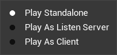

# UE5多人在线游戏

## BasicConcept概念

### 链接方式

#### P2P（Peer to Peer）对等网络

在玩家网络之中直接互相发送**操作信息**

优点：

1. 玩家少时简单方便

缺点：

1. 随着玩家数量的增多，网络传输压力大
2. 没有权威的游戏版本，玩家游戏版本不统一可能会造成部分问题（无法确定信息的正确性，无法检查作弊等）
3. 数据保密性较差
4. 计算机资源占用大

#### 客户机/服务器(C/S)模式

由一个统一的机器组成服务器，其他机器作为Client客户机向服务器发送**操作请求**和接受信息

服务器在接收到操作请求并确保操作的可行性后会将操作的信息**Replication**分发到所有客户端

优点：

1. 游戏版本权威，能够保证实例的相对正确性
2. 客户端只要满足基本带宽要求即可实现


以下是两种C/S Model

##### Listen-Server

一个玩家充当服务器，此时服务器这台机器则同时承担了**游戏游玩**和**为服务器版本渲染画面**

此时主机玩家没有延迟，但是随着玩家的增多，对于主机的网络要求逐渐增加

##### Dedicated-Server

一个机器充当专用服务器，不承担任何渲染的工作同时也无玩家进行游玩操作，此时这台机器只负责数据的处理和信息的接受分发

所有玩家都有延迟

#### UE 处理方式 Authoritative C/S

在进行单人游戏时，玩家仍在使用C/S Model进行游玩，只不过此时服务器和客户机为同一机器

### 测试方法

在PIE（Play In Editor）模式下，点击Play按钮旁的按钮调出菜单


通过修改Number Of Players可以增减游戏实例数量

同时也可以修改Net Mode来修改网络模式调整多人游戏运行的方式



**Play Standalone** 

游戏将以单机离线模式启动，既不会创建一个专用服务器(Dedicated Server)也不会自动连接到一个服务器,但是如果需要测试Offline->Server的连接流,则可以激活`bLaunchSeparateServer`来启动一个Server

**Play As Listen Server**

编辑器将会同时承担服务端和客户端,随着玩家数量(Number of Players)的增多,更多实例会自动启动

**Play As Client**

编辑器将会以客户端模式启动,并自动连接至一个后台自动启动的服务器

#### 局域网联机

##### 蓝图

**服务端调用**

`Open Level (by Name)`


通过设定LevelName加入指定关卡

Options填写listen表示作为监听服务器启动


**客户端调用**

`Execute Console Command`


通过在客户端调用控制台代码`Open xxx.xxx.xxx.xxx `来加入服务端

此地址为服务端的Ipv4地址

##### C++

```c++
//服务端调用
void OpenLobby(){
    UWorld* World = GetWorld();
    if(World){
        World->ServerTravel("/文件相对路径?listen");// ?listen为Options,意为作为监听服务器启动
    }
}


//客户端调用

//方法一
//调用OpenLevel
void CallOpenLevel(const FString& Address){
    UGameplayStatics::OpenLevel(this, *Address);
}

//方法二
//调用ClientTravel
void CallClientTravel(const FString& Address){
    APIayerController* PIayerController = GetGameInstance( )->GetFirstLocaIPIayerControIIer()
	if (PIayerController){
        PIayerController->ClientTravel(Address, ETravelType::Travel_Absolute);
        //第二个参数可以根据个人需求更改,
    }
}

```


##### 涉及API

`UGameplayStatics::OpenLevel`

OpenLevel实际上也是调用ClientTravel

```c++
	/**
	 * 切换至另一关卡
	 *
	 * @param	LevelName			要打开的关卡
	 * @param	bAbsolute			 如果为真，选项设置将被重置，如果为假，选项设置将保留当前关卡设定
	 * @param	Options				   一串用于切换URL的选项。
	 */
	UFUNCTION(
        BlueprintCallable, 
        meta=(
            WorldContext="WorldContextObject",
            AdvancedDisplay = "2", 
            DisplayName = "Open Level (by Name)"
        ), 
        Category="Game")
	static void OpenLevel(const UObject* WorldContextObject, FName LevelName, bool bAbsolute = true, FString Options = FString(TEXT("")));

```

`UEngine::Browse`

- 就像是加载新地图时的硬重置。
- 将始终导致非无缝切换(Non-Seamless-Travel)。
- 将导致服务器在切换到目标地图前与当前客户端断开连接。
- 客户端将与当前服务器断开连接。
- 专用服务器无法切换至其他服务器，因此地图必须存储在本地（不能是 URL）。

``` c++
/** 浏览到一个指定的URL，相对于当前的URL */
	virtual EBrowseReturnVal::Type Browse( FWorldContext& WorldContext, FURL URL, FString& Error );
```


`::ServerTravel`

- 仅适用于服务器。
- 会将服务器跳转到新的世界/场景。
- 所有连接的客户端都会跟随。
- 这就是多人游戏在地图之间转移时所用的方法，而服务器将负责调用此函数。
- 服务器将为所有已连接的客户端玩家调用 `APlayerController::ClientTravel`。

```c++
	/**
	 * 将服务器跳转到新的级别。 如果bAbsolute为真，并且我们使用的是seemless travel,
	 * 我们将做一个绝对路径切换（URL将被刷新）
	 *
	 * @param URL				我们要前往的URL
	 * @param bAbsolute 	我们是使用相对路径切换还是绝对路径切换
	 * @param bShouldSkipGameNotify 是否要通知客户端/游戏
	 */
	bool ServerTravel(const FString& InURL, bool bAbsolute = false, bool bShouldSkipGameNotify = false);

	/** 无缝地前往给定的URL，首先在后台加载入口层。
	 * 切换到它，然后再加载指定的级别。不会中断网络通信或断开客户端。
	 * 你可能需要实现GameModeBase::GetSeamlessTravelActorList(), PlayerController::GetSeamlessTravelActorList()。
	 * GameModeBase::PostSeamlessTravel()，和/或GameModeBase::HandleSeamlessTravelPlayer()，以处理保存任何应该保持的信息（玩家团队）。
	 * 这个代码路径是为很少或没有使用关卡流的世界以及游戏状态在转换时被重置/重载的GameModes设计的。
	 * 在转换时被重置/重新加载。(如UT)
	 * @param URL - 前往的URL；必须与当前URL在同一服务器上。
	 * @param bAbsolute (opt) - 如果是真的，URL是绝对的，否则是相对的。
	 */
	void SeamlessTravel(const FString& InURL, bool bAbsolute = false);
```

` APlayerController::ClientTravel`

- 如果从客户端调用，则转移到新的服务器
- 如果从服务器调用，则要求特定客户端转移到新地图（但仍然连接到当前服务器）

```c++
	/**
	 * 前往不同的地图或IP地址。在执行任何操作之前调用PreClientTravel事件。
	 * 注意：这是作为ClientTravelInternal的本地执行的包装器实现的，以避免API兼容性破坏。
	 *
	 * @param URL			一个包含要去的地图名称（或IP地址）的字符串，以及选项键/值对。
	 * @param TravelType	指定客户端是否应该追加以前旅行中使用的URL选项；如果为bSeamlesss参数
	 * 						指定为true，这个值必须是TRAVEL_Relative。
	 * @param bSeamless		表示是否使用无缝切换（要求TravelType为TRAVEL_Relative）。
	 * @param MapPackageGuid要前往的地图包的GUID--当文件被自动下载时，这将用于查找文件。
	 * 						所以它只需要用于客户端
	 */
	UFUNCTION()
	void ClientTravel(const FString& URL, enum ETravelType TravelType, bool bSeamless = false, FGuid 

```


#### 广域网联机(使用UnrealOnlineSubsystem进行Steam的多人联机)

##### 一些概念Concept

**虚幻在线子系统简易结构**


前往Engine.ini指定默认的平台服务


通过`IOnlineSubsystem::Get()`获取`IOnlineSubsytem*`后可以访问各类提供的接口


**会话接口**

- 创建，管理和销毁游戏会话 Creating, managing, and destroying online seesions
- 搜索会话 Searching for sessions
- 匹配 Matchmaking

**会话**

- 可以认为是一个在服务器运行的多人联机游戏实例
- 可以对外公开（可以加入）也可以私有（仅限邀请）

**会话寿命**

1. 创建会话
2. 等待玩家加入
3. 注册玩家
4. 开始会话
5. 游玩
6. 结束会话
7. 注销玩家
8. 更新会话或者销毁会话


##### 添加插件步骤（以steam为例）

0. 可参考[UE官方文档](https://docs.unrealengine.com/5.1/zh-CN/online-subsystem-steam-interface-in-unreal-engine/)
1. 先去编辑器安装插件 OnlineSubsystemSteam
2. 打开IDE，编辑"项目名称.build.cs"
3. 找到`PublicDependencyModuleNames.AddRange`后的字符串数组中添加对应的插件名称，例如本次需要添加`"OnlineSubsystemSteam"`和`"OnlineSubsystem"`
4. 前往Config文件夹找到DefaultEngine.ini
5. 将下面一段代码添加入ini文件(注释可删)
6. ```ini
   [/Script/Engine.GameEngine]
   +NetDriverDefinitions=(DefName="GameNetDriver",DriverClassName="OnlineSubsystemSteam.SteamNetDriver",DriverClassNameFallback="OnlineSubsystemUtils.IpNetDriver")
   
   ; NetDriverDefinitions 		描述了可供UE使用的网络驱动器，并添加了以下属性：
   ; DefName					是该网络驱动器定义的唯一名称。
   ; DriverClassName 			是主网络驱动器的类名称。
   ; DriverClassNameFallBack 	是退却网络驱动器的类名（如果主网络驱动器类初始化失败）。
   
   ; 为了告诉UE使用Online Subsystem Steam，添加以下设置：
   [OnlineSubsystem]
   DefaultPlatformService=Steam
   
   ; 现在，你已经告诉UE，你希望应用程序使用Steam Online Subsystem，接下来需要添加以下设置来配置 OnlineSubsystemSteam 模块：
   ; If using Sessions
   ; bInitServerOnClient=true
   ; If using lobby
   ; skipping is ok
   [OnlineSubsystemSteam]
   bEnabled=true
   SteamDevAppId=480
   
   
   ;最后，需要为应用程序连接在网络驱动器中指定Steam类：
   [/Script/OnlineSubsystemSteam.SteamNetDriver]
   NetConnectionClassName="OnlineSubsystemSteam.SteamNetConnection"
   ```
7. 回到项目文件夹，关闭IDE和Editor，删除Binaries，Intermediate，Saved文件夹，然后右键uproject重新Generate project file


##### 会话创建步骤

###### 链接到在线子系统

```c++
//在头文件里声明

public:
    IOnlineSessionPtr OnlineSessionInterface;
     //IOnlineSessionPtr是前向声明，需引入头文件"OnlineSubsystem.h"


//在cpp文件的构造函数进行初始化

AXXXCharacter::AXXXCharacter()
{
    ……;
    //获取接口
    if(IOnlineSubsystem* OnlineSubsystem =IOnlineSubsystem::Get())
    {
        OnlineSessionInterface = OnlineSubsystem->GetSessionInterface();
        //可debug输出获取信息
    }
}
```

###### 头文件声明

```c++
protected:
    //创建会话调用的方法
    UFUNCTION(BlueprintCallable)
    void CreateGameSession();

    //所要绑定的委托方法
    void OnCreateSessionComplete(FName SessionName, bool bWasSuccessful);

private:
    FOnCreateSessionCompleteDelegate CreateSessionCompleteDelegate;
    //同上，前向声明引入头文件"Interfaces/OnlineSessionInterface.h"

```

###### 编写细节

```c++
//在cpp文件的构造函数进行初始化

AXXXCharacter::AXXXCharacter():
	CreateSessionCompleteDelegate(FOnCreateSessionCompleteDelegate::CreateUObject(this, &ThisClass::OnCreateSessionComplete))//初始化列表进行委托绑定
{
  ……;
}

------------------------------------------------------------------------------------------
    
  //在cpp文件添加
void AMultiPlayerCharacter::CreateGameSession()
{
    if (!OnlineSessionInterface.IsValid())//检查会话有效性
    {
        return;
    }
    auto ExistingSession = OnlineSessionInterface->GetNamedSession(NAME_GameSession);
    if(ExistingSession != nullptr)//检查是否有同名会话
    {
        OnlineSessionInterface->DestroySession(NAME_GameSession);
            OnlineSessionInterface->OnCreateSessionCompleteDelegates.RemoveAll(this);
      //销毁会话的同时删除所有委托，否则会出现重复绑定委托的情况
    }

    //绑定委托至会话
    OnlineSessionInterface->
      AddOnCreateSessionCompleteDelegate_Handle(CreateSessionCompleteDelegate);

    //创建个会话设置并创建会话
    TSharedPtr<FOnlineSessionSettings> SessionSettings = MakeShareable(new FOnlineSessionSettings());
    const ULocalPlayer* LocalPlayer =GetWorld()->GetFirstLocalPlayerFromController();
    SessionSettings->bIsLANMatch = false;			//不是局域网匹配
    SessionSettings->NumPublicConnections = 4;		//最大玩家数4
    SessionSettings->bAllowJoinInProgress = true;	//允许进程中参与
    SessionSettings->bAllowJoinViaPresence = true;	//允许通过区域匹配机制
    SessionSettings->bShouldAdvertise = true;		//设置为可公开的
    SessionSettings->bUsesPresence = true;			//使用区域匹配
    SessionSettings->bUseLobbiesIfAvailable = true;	//（可能的解决方案）如果可以使用大厅
    OnlineSessionInterface->CreateSession(*LocalPlayer->GetPreferredUniqueNetId(),
                                        NAME_GameSession,*SessionSettings);
}

------------------------------------------------------------------------------------------

//测试用委托
void AMultiPlayerCharacter::OnCreateSessionComplete(FName SessionName, bool bWasSuccessful)
{
    if(!bWasSuccessful)
    {
        if(GEngine)
        {
                GEngine->AddOnScreenDebugMessage(-1,5,FColor::Blue,
                      FString::Printf(TEXT("Failed to create session")));
        }

      //可以添加相关函数打开LobbyMap
    }
    if(GEngine)
    {
        GEngine->AddOnScreenDebugMessage(-1,5,FColor::Blue,
          FString::Printf(TEXT("Create session: %s"),*SessionName.ToString()));
    }

    if(UWorld* World = GetWorld())
    {
        World->ServerTravel("/Game/ThirdPerson/Maps/ThirdPersonMap?listen");//打开大厅房间
    }
}
```

##### 寻找会话步骤

###### 链接到在线子系统

```c++
//在头文件里声明

public:
    IOnlineSessionPtr OnlineSessionInterface;
     //IOnlineSessionPtr是前向声明，需引入头文件"OnlineSubsystem.h"


//在cpp文件的构造函数进行初始化

AXXXCharacter::AXXXCharacter()
{
    ……;
    //获取接口
    if(IOnlineSubsystem* OnlineSubsystem =IOnlineSubsystem::Get())
    {
        OnlineSessionInterface = OnlineSubsystem->GetSessionInterface();
        //可debug输出获取信息
    }
}
```

###### 头文件声明

```c++
protected:
    //创建会话调用的方法
    UFUNCTION(BlueprintCallable)
    void CreateGameSession();

    //所要绑定的委托方法
    void OnCreateSessionComplete(FName SessionName, bool bWasSuccessful);

protected:
    //搜索会话调用的方法
    UFUNCTION(BlueprintCallable)
    void FindGameSession();

    //所要绑定的委托方法
    void OnFindSessionsComplete(bool bWasSuccessful);

private:
    FOnFindSessionsCompleteDelegate FindSessionsCompleteDelegate;
    //同上，前向声明引入头文件"Interfaces/OnlineSessionInterface.h"

    //用于指向搜索结果
    TSharedPtr<FOnlineSessionSearch> SessionSearch;


```

###### 编写细节

```c++
//在cpp文件的构造函数进行初始化

AXXXCharacter::AXXXCharacter():
    ……,
    FindSessionsCompleteDelegate(
    	FOnFindSessionsCompleteDelegate::CreateUObject(this,&ThisClass::OnFindSessionsComplete))//初始化列表进行委托绑定
{
        ……;
}

------------------------------------------------------------------------------------------
  
//在cpp文件添加
void AMultiPlayerCharacter::FindGameSession()
{
    if (!OnlineSessionInterface.IsValid())
    {
        return;
    }

    OnlineSessionInterface->OnFindSessionsCompleteDelegates.RemoveAll(this);
    OnlineSessionInterface->AddOnFindSessionsCompleteDelegate_Handle(FindSessionsCompleteDelegate);

    SessionSearch = MakeShareable(new FOnlineSessionSearch());
    SessionSearch->MaxSearchResults = 10000;//最大搜索结果10000
    SessionSearch->bIsLanQuery = false;//不使用局域网
    SessionSearch->QuerySettings.Set(SEARCH_PRESENCE, true, EOnlineComparisonOp::Equals);
    //搜索配置为寻找 等于 启用 PRESENCE匹配的 会话

    const ULocalPlayer* LocalPlayer = GetWorld()->GetFirstLocalPlayerFromController();
    OnlineSessionInterface->FindSessions(*LocalPlayer->GetPreferredUniqueNetId(), SessionSearch.ToSharedRef());

}

------------------------------------------------------------------------------------------

//测试用委托
void AMultiPlayerCharacter::OnFindSessionsComplete(bool bWasSuccessful)
{
    if (!OnlineSessionInterface.IsValid())
    {
        return;
    }

    for (auto Result : SessionSearch->SearchResults)
    {
        FString ID = Result.GetSessionIdStr();
        FString User = Result.Session.OwningUserName;
        if (GEngine)
        {
            GEngine->AddOnScreenDebugMessage(
                -1, 5, FColor::Blue,
                FString::Printf(TEXT("ID: %s, User：%s"), *ID, *User));
        }
    }
}
```

##### 加入会话步骤

###### 头文件声明

```c++
protected:
    //可选，这里只是为了划分步骤特地分函数
    void JoinGameSession(const FOnlineSessionSearchResult& SessionSearchResult);

    void OnJoinSessionComplete(FName SessionName, EOnJoinSessionCompleteResult::Type Result);

private:
    FOnJoinSessionCompleteDelegate JoinSessionCompleteDelegate;


```

###### 编写细节

```c++
//在cpp文件的构造函数进行初始化

AXXXCharacter::AXXXCharacter():
    ……,
    JoinSessionCompleteDelegate(
    	FOnJoinSessionCompleteDelegate::CreateUObject(this,&ThisClass::OnJoinSessionComplete))//初始化列表进行委托绑定
{
    ……;
}

------------------------------------------------------------------------------------------

//自定义条目筛选
    
//创建会话时设置
//可以设置会话的CustomKey值为CustomValue
SessionSettings->Set(FName("CustomKey"), FString("CustomValue"), EOnlineDataAdvertisementType::ViaOnlineServiceAndPing);

//搜索会话时设置
//可以在搜索会话时使用进行比较匹配从而达到筛选的目的
SessionSettings->Get(FName("CustomKey"), outVariable)
    
------------------------------------------------------------------------------------------
    
//在cpp文件添加
    
//在创建会话时添加指定标签
void AMultiPlayerCharacter::CreateGameSession()
{
    ……
    SessionSettings->Set(FName("CustomKey"), FString("CustomValue"), EOnlineDataAdvertisementType::ViaOnlineServiceAndPing);
    ……
}

//在找到会话时检查标签
void AMultiPlayerCharacter::OnFindSessionsComplete(bool bWasSuccessful)
{
    ……
    for(……)//遍历搜索结果
    {
        ……
        FString OutValue;

        Result.Session.SessionSettings.Get(FName("CustomKey"),OutValue);
        if(OutValue==FString("CustomValue")
        {
            //debug输出
            OnlineSessionInterface->
                AddOnJoinSessionCompleteDelegate_Handle(JoinSessionCompleteDelegate);
        } 
    }
}
                   
void AMultiPlayerCharacter::JoinGameSession(const FOnlineSessionSearchResult& SessionSearchResult)
{
	OnlineSessionInterface->AddOnJoinSessionCompleteDelegate_Handle(JoinSessionCompleteDelegate);
	const ULocalPlayer* LocalPlayer = GetWorld()->GetFirstLocalPlayerFromController();
	OnlineSessionInterface->JoinSession(*LocalPlayer->GetPreferredUniqueNetId(), NAME_GameSession, SessionSearchResult);
}

------------------------------------------------------------------------------------------

//测试用委托
void AMultiPlayerCharacter::OnJoinSessionComplete(FName SessionName, EOnJoinSessionCompleteResult::Type Result) const
{
    if (!OnlineSessionInterface.IsValid())
    {
        return;
    }

    FString Address;
    if(OnlineSessionInterface->GetResolvedConnectString(NAME_GameSession, Address))
    {
        if (GEngine)
        {
            GEngine->AddOnScreenDebugMessage(
                -1, 5, FColor::Blue,
                FString::Printf(TEXT("Address: %s"), *Address));
        }

        if(APlayerController* PlayerController = GetGameInstance()->GetFirstLocalPlayerController())
        {
            PlayerController->ClientTravel(Address, ETravelType::TRAVEL_Absolute);
        }
    }
}
```

## 编写插件

### 插件和模块 Plugins and Modules

[官方文档](https://docs.unrealengine.com/5.1/zh-CN/gameplay-modules-in-unreal-engine/)

正如引擎本身由一组模块(Module)构成一样，每个游戏也是由一个或多个游戏性模块构成的。一个模块是实现某一个或一类功能的集合，当模块足够独立和庞大、复杂之后，可以将其提升为插件(Plugin)。UE5引擎就是由众多模块组成，而插件也可以包含一个或多个模块，但模块却不能包含插件。相对于模块来说，插件具有更高的独立性，而且还可以非常方便地移植到不同项目中使用。

#### 模块

模块的特点：

> 是一个独立的C++代码单元（只含代码不含content）
>
> 包含一个build文件(.Build.cs)
>
> 只含代码
>
> 封装性(每个模块有单独的设计目的)
>
> 结构清晰
>
> 项目的本身就是一个模块
>
>


#### 新建插件步骤

1. 点击 Settings->Plugins 或者 Edit->Plugins 打开插件窗口
2. 点击Add按钮
3. 
4. 注意：插件名不能与项目重名
5. Reload项目，找到对应插件文件夹底下的.uplugin文件添加需要的模块或者插件依赖

```json
{
	……
	"Modules": [
		{
			"Name": "MultiPlayerPlugin",//这是插件自动创建的模块
			"Type": "Runtime",
			"LoadingPhase": "Default"
		}
	],
	"Plugins": [//这两个插件是需要手动添加的
		{
			"Name": "OnlineSubsystem",
			"Enabled": true
		},
		{
			"Name": "OnlineSubsystemSteam",
			"Enabled": true
		}
	]
}
```

6. 接着前往项目文件.Build.cs文件内将依赖模块或插件名放入DependencyModuleNames内的字符串数组里

```c#
public class MultiPlayerPlugin : ModuleRules
{
	public MultiPlayerPlugin(ReadOnlyTargetRules Target) : base(Target)
	{
		//...
        
        //公共依赖则可以在模块内都访问到
		PublicDependencyModuleNames.AddRange(
			new string[]
			{
				"Core",
                "OnlineSubsystem",//本次演示添加于此处
				"OnlineSubsystemSteam"
				// ... add other public dependencies that you statically link with here ...
			}
			);
			
		//私有依赖仅有Private文件夹下的代码能访问到
		PrivateDependencyModuleNames.AddRange(
			new string[]
			{
				"CoreUObject",
				"Engine",
				"Slate",
				"SlateCore",
				// ... add private dependencies that you statically link with here ...	
			}
			);
		
		//...
}

```


#### 编写插件

##### 添加前置插件（Steam在线联机子系统）

0. 可参考[UE官方文档](https://docs.unrealengine.com/5.1/zh-CN/online-subsystem-steam-interface-in-unreal-engine/)

1. 先去编辑器安装插件 OnlineSubsystemSteam

2. 打开IDE，编辑"项目名称.build.cs"

3. 找到`PublicDependencyModuleNames.AddRange`后的字符串数组中添加对应的插件名称，例如本次需要添加`"OnlineSubsystemSteam"`和`"OnlineSubsystem"`

4. 前往Config文件夹找到DefaultEngine.ini

5. 将下面一段代码添加入ini文件(注释可删)

6. ```ini
	[/Script/Engine.GameEngine]
	+NetDriverDefinitions=(DefName="GameNetDriver",DriverClassName="OnlineSubsystemSteam.SteamNetDriver",DriverClassNameFallback="OnlineSubsystemUtils.IpNetDriver")
	
	; NetDriverDefinitions 		描述了可供UE使用的网络驱动器，并添加了以下属性：
	; DefName					是该网络驱动器定义的唯一名称。
	; DriverClassName 			是主网络驱动器的类名称。
	; DriverClassNameFallBack 	是退却网络驱动器的类名（如果主网络驱动器类初始化失败）。
	
	; 为了告诉UE使用Online Subsystem Steam，添加以下设置：
	[OnlineSubsystem]
	DefaultPlatformService=Steam
	
	; 现在，你已经告诉UE，你希望应用程序使用Steam Online Subsystem，接下来需要添加以下设置来配置 OnlineSubsystemSteam 模块：
	; If using Sessions
	; bInitServerOnClient=true
	; If using lobby
	; skipping is ok
	[OnlineSubsystemSteam]
	bEnabled=true
	SteamDevAppId=480
	bInitServerOnClient=true
	b
	
	;最后，需要为应用程序连接在网络驱动器中指定Steam类：
	[/Script/OnlineSubsystemSteam.SteamNetDriver]
	NetConnectionClassName="OnlineSubsystemSteam.SteamNetConnection"
	```

7. 同时将下面一段代码粘贴至DefaultGame.ini

8. ```ini
	;设置这个游戏项目最大可以有 100 个玩家
	;与前面创建 Session 时的 NumPublicConnections 不同，上面是会话最大连接数，这个是这个游戏项目最大玩家数
	[/Script/Engine.GameSession]
	MaxPlayers=100
	
	```

9. 回到项目文件夹，关闭IDE和Editor，删除Binaries，Intermediate，Saved文件夹，然后右键uproject重新Generate project file

##### 选择脚本基类

**GameInstance**

> 在游戏开始被创建
>
> 直到游戏结束前一直存在
>
> 切换关卡仍然保留
>
>  
>
> 太过庞大
>
> 随着代码量增加维护难
>
> 修改或者覆盖引擎源码比较复杂麻烦


**GameInstanceSubsystem**

> 在GameInstance创建后被创建
>
> 在GameInstance销毁时销毁
>
>  
>
> 简易使用
>
> 专门为扩展而生


**[官方](https://docs.unrealengine.com/5.1/zh-CN/programming-subsystems-in-unreal-engine/)对于SubSystem的介绍**

> 举例而言，如果创建了一个派生自此基类的类：
>
> ```c++
> class UMyGamesSubsystem : public UGameInstanceSubsystem
> ```
>
> 将出现以下结果：
>
> 1. 创建 `UGameInstance` 之后，还会创建一个名为 `UMyGamesSubsystem` 的实例。
> 2. `UGameInstance` 初始化时，将在子系统上调用 `Initialize()`。
> 3. `UGameInstance` 关闭时，将在子系统上调用 `Deinitialize()`。
> 4. 此时将放弃对子系统的引用，如果不再有对子系统的引用，则其将被垃圾回收。
>
>  
>
> #### 使用子系统的原因
>
> 使用编程子系统有以下几个原因：
>
> - 子系统可节省编程时间。
> - 子系统使您无需覆盖引擎类。
> - 子系统使您无需再已经很复杂的类上添加更多API。
> - 子系统使您能通过用户友好的类型化节点来访问蓝图。
> - 子系统允许访问Python脚本来编写编辑器脚本或编写测试代码。
> - 子系统在代码库中提供模块化和一致性。
>
> 子系统在创建插件时尤为实用。您不需要代码相关的说明即可让插件工作。用户只需将插件添加到游戏中，就可以确切了解插件将在何时被实例化和初始化。因此，您可以专注于UE4中提供的API和功能的使用方式。


##### 创建C++类

1. 点击C++Classes文件夹空白处点击`New C++ Class`
2. 选择UGameInstanceSubsystem为父类
3. 选择类模块为插件模块


##### Step 1 声明相关委托及变量

###### 头文件

```c++
public:
	UMultiPlayerSessionsSubsystem();


	//
	// To handle session functionality. The Menu class will call these
	//
	void CreateSession(int32 NumPublicConnections, FString CustomKeyValue);
	void FindSessions(int32 MaxSearchResults);
	void JoinSessions(const FOnlineSessionSearchResult& SessionSearchResult);
	void DestroySession();
	void StartSession();
	
protected:
	//
	// Internal callbacks for the delegates we'll add to the Online Session Interface delegate list
	// These don't need to be called outside this class
	//
	void OnCreateSessionComplete(FName SessionName, bool bWasSuccessful);
	void OnFindSessionsComplete(bool bWasSuccessful);
	void OnJoinSessionComplete(FName SessionName, EOnJoinSessionCompleteResult::Type Result);
	void OnDestroySessionComplete(FName SessionName, bool bWasSuccessful);
	void OnStartSessionComplete(FName SessionName, bool bWasSuccessful);


	
private:
	IOnlineSessionPtr SessionInterface;

	//
	// To add to the Online Session Interface delegate list.
	// We'll bind our internal callbacks to these.
	//
	FOnCreateSessionCompleteDelegate CreateSessionCompleteDelegate;
	FOnFindSessionsCompleteDelegate FindSessionsCompleteDelegate;
	FOnJoinSessionCompleteDelegate JoinSessionCompleteDelegate;
	FOnDestroySessionCompleteDelegate DestroySessionCompleteDelegate;
	FOnStartSessionCompleteDelegate StartSessionCompleteDelegate;
	
	FDelegateHandle CreateSessionCompleteDelegateHandle;
	FDelegateHandle FindSessionsCompleteDelegateHandle;
	FDelegateHandle JoinSessionCompleteDelegateHandle;
	FDelegateHandle DestroySessionCompleteDelegateHandle;
	FDelegateHandle StartSessionCompleteDelegateHandle;
```

###### cpp文件

```c++
UMultiPlayerSessionsSubsystem::UMultiPlayerSessionsSubsystem():
CreateSessionCompleteDelegate(FOnCreateSessionCompleteDelegate::CreateUObject(this,&ThisClass::OnCreateSessionComplete)),
FindSessionsCompleteDelegate(FOnFindSessionsCompleteDelegate::CreateUObject(this,&ThisClass::OnFindSessionsComplete)),
JoinSessionCompleteDelegate(FOnJoinSessionCompleteDelegate::CreateUObject(this,&ThisClass::OnJoinSessionComplete)),
DestroySessionCompleteDelegate(FOnDestroySessionCompleteDelegate::CreateUObject(this,&ThisClass::OnDestroySessionComplete)),
StartSessionCompleteDelegate(FOnStartSessionCompleteDelegate::CreateUObject(this,&ThisClass::OnStartSessionComplete))
{
	if (IOnlineSubsystem* OnlineSubsystem = IOnlineSubsystem::Get())
	{
		SessionInterface = OnlineSubsystem->GetSessionInterface();
		if (GEngine)
		{
			GEngine->AddOnScreenDebugMessage(
				-1,
				5.f,
				FColor::Black,
				FString::Printf(TEXT("Found Subsystem %s"), *OnlineSubsystem->GetSubsystemName().ToString()));
		}
	}
}
```


##### Step 2 新建MenuClass创造WidgetButton

为插件模块新增基于UUserWidget的c++类

> 需要去Build.cs添加依赖
>
> ```
> "UMG","Slate","SlateCore"
> ```

###### 头文件

```C++
public:
	//
	// 菜单的添加
	//
	UFUNCTION(BlueprintCallable)
	void MenuSetup(
		int32 NumberOfPublicConnections = 4,
		FString ValueOfCustomKey = FString(TEXT("Free")),
		FString LobbyPath = FString(TEXT("/Game/StarterContent/Maps/Minimal_Default")));

protected:
	virtual bool Initialize() override;
	virtual void NativeDestruct() override;

	//
	// Callbacks for the custom delegates on the MultiplayerSessionsSubsystem
	// 用于联机子系统的自定义委托的回调函数
	//
	UFUNCTION()
	void OnCreateSession(bool bWasSuccessful);
	void OnFindSessions(const TArray<FOnlineSessionSearchResult>& SessionResult, bool bWasSuccessful);
	void OnJoinSession(EOnJoinSessionCompleteResult::Type Result);
	UFUNCTION()
	void OnDestroySession(bool bWasSuccessful);
	UFUNCTION()
	void OnStartSession(bool bWasSuccessful);

	
private:

	//
	// 绑定MenuWidget里的按钮
	//
	UPROPERTY(meta = (BindWidget))
	UButton* HostButton;

	UPROPERTY(meta = (BindWidget))
	UButton* JoinButton;

	//
	// 按钮的点击事件
	//
	UFUNCTION()
	void HostButtonClicked();

	UFUNCTION()
	void JoinButtonClicked();

	// 界面销毁时调用
	void MenuTearDown();


	UMultiPlayerSessionsSubsystem* MultiPlayerSessionsSubsystem; // 联机子系统
	int32 NumPublicConnections{4};			//最大连接数量
	FString CustomKeyValue{TEXT("Free")};	//自定义标签值
	FString PathToLobby{TEXT("")};			//大厅关卡路径
	

```

###### cpp

```c++
void UMenuWidget::MenuSetup(int32 NumberOfPublicConnections , FString ValueOfCustomKey)
{
    //参数读取至成员变量
	NumPublicConnections = NumberOfPublicConnections;
	CustomKeyValue = ValueOfCustomKey;
    PathToLobby = FString::Printf(TEXT("%s?listen"),*LobbyPath);
	//添加至世界
    AddToViewport();
	SetVisibility(ESlateVisibility::Visible);
	bIsFocusable = true;

	if(UWorld* World = GetWorld())
	{
		if(APlayerController* PlayerController = World->GetFirstPlayerController())
		{
			FInputModeUIOnly InputModeData;
			InputModeData.SetWidgetToFocus(TakeWidget());
			InputModeData.SetLockMouseToViewportBehavior(EMouseLockMode::DoNotLock);
			PlayerController->SetInputMode(InputModeData);
			PlayerController->SetShowMouseCursor(true);
		}
	}
	
    //获取联机子系统
	if(UGameInstance* GameInstance=GetGameInstance())
	{
		MultiPlayerSessionsSubsystem = GameInstance->GetSubsystem<UMultiPlayerSessionsSubsystem>();
	}
	//绑定委托
	if(MultiPlayerSessionsSubsystem)
	{
		MultiPlayerSessionsSubsystem->MultiPlayerOnCreateSessionComplete.AddDynamic(
            this, &ThisClass::OnCreateSession);
		MultiPlayerSessionsSubsystem->MultiPlayerOnFindSessionsComplete.AddUObject(
            this, &ThisClass::OnFindSessions);
		MultiPlayerSessionsSubsystem->MultiPlayerOnJoinSessionComplete.AddUObject(
            this, &ThisClass::OnJoinSession);
		MultiPlayerSessionsSubsystem->MultiPlayerOnDestroySessionComplete.AddDynamic(
            this, &ThisClass::OnDestroySession);
		MultiPlayerSessionsSubsystem->MultiPlayerOnStartSessionComplete.AddDynamic(
            this, &ThisClass::OnStartSession);
	}
}

// Widget初始化时调用
bool UMenuWidget::Initialize()
{
	if(!Super::Initialize())
	{
		return false;
	}

	if(HostButton)
	{
		HostButton->OnClicked.AddDynamic(this, &ThisClass::HostButtonClicked);
	}
	if(JoinButton)
	{
		JoinButton->OnClicked.AddDynamic(this, &ThisClass::JoinButtonClicked);
	}
	return true;
}

// Widget被销毁时调用
void UMenuWidget::NativeDestruct()
{
	MenuTearDown();
	Super::NativeDestruct();
}

/**
 * @brief 绑定联机插件的委托函数\n
 *		  创建会话后调用
 * @param bWasSuccessful 会话是否创建成功
 */
void UMenuWidget::OnCreateSession(bool bWasSuccessful)
{
	if(bWasSuccessful)
	{
		if(GEngine)
		{
			GEngine->AddOnScreenDebugMessage(
				-1, 5.f,
				FColor::Yellow,
				FString(TEXT("Session created successfully"))
				);
		}
		if(UWorld* World=GetWorld())
		{
			World->ServerTravel("/Game/StarterContent/Maps/Minimal_Default?listen");
		}
	}
	else
	{
		if(GEngine)
		{
			GEngine->AddOnScreenDebugMessage(
				-1, 5.f,
				FColor::Red,
				FString(TEXT("Failed to created session"))
				);
		}
        HostButton->SetIsEnabled(true);
	}
}

/**
 * @brief 绑定联机插件的委托函数\n
 *		  搜索会话后调用
 * @param SessionResult 搜索结果数组
 * @param bWasSuccessful 会话是否创建成功
 */
void UMenuWidget::OnFindSessions(const TArray<FOnlineSessionSearchResult>& SessionResult, bool bWasSuccessful)
{
	if(MultiPlayerSessionsSubsystem == nullptr)
	{
		if(GEngine)
		{
			GEngine->AddOnScreenDebugMessage(
				-1, 5.f,
				FColor::Yellow,
				FString(TEXT("Failed To Connect Subsystem")));
		}
		return;
	}
	for (auto Result : SessionResult)
	{
		FString OutSettingsValue; 
		Result.Session.SessionSettings.Get(FName("CustomKey"),OutSettingsValue);
		if(OutSettingsValue == CustomKeyValue)
		{
			MultiPlayerSessionsSubsystem->JoinSessions(Result);
			return;
		}
	}
	if(!bWasSuccessful || SessionResult.Num() == 0)
	{
		JoinButton->SetIsEnabled(true);
	}
}

/**
 * @brief 绑定联机插件的委托函数\n
 *		  加入会话后调用
 * @param bWasSuccessful 会话是否创建成功
 */
void UMenuWidget::OnJoinSession(EOnJoinSessionCompleteResult::Type Result)
{
	if (IOnlineSubsystem* OnlineSubsystem = IOnlineSubsystem::Get())
	{
		IOnlineSessionPtr SessionInterface = OnlineSubsystem->GetSessionInterface();
		if(SessionInterface.IsValid())
		{
			FString Address;
			SessionInterface->GetResolvedConnectString(NAME_GameSession, Address);
			if (APlayerController* PlayerController = GetGameInstance()->GetFirstLocalPlayerController())
			{
				PlayerController->ClientTravel(Address, ETravelType::TRAVEL_Absolute);
			}
		}
	}
	if(Result != EOnJoinSessionCompleteResult::Success)
	{
		JoinButton->SetIsEnabled(true);
	}
}
/**
 * @brief 绑定联机插件的委托函数\n
 *		  销毁会话后调用
 * @param Result 销毁会话的结果
 */
void UMenuWidget::OnDestroySession(bool bWasSuccessful)
{
}
/**
 * @brief 绑定联机插件的委托函数\n
 *		  开始会话后调用
 * @param Result 加入会话的结果
 */
void UMenuWidget::OnStartSession(bool bWasSuccessful)
{
}

//主持按钮点击事件
void UMenuWidget::HostButtonClicked()
{
	if(GEngine)
	{
		GEngine->AddOnScreenDebugMessage(
			-1, 5.f,
			FColor::Yellow,
			FString(TEXT("Host Button Clicked"))
			);
	}
	if(MultiPlayerSessionsSubsystem)
	{
		HostButton->SetIsEnabled(false);
		MultiPlayerSessionsSubsystem->CreateSession(NumPublicConnections, CustomKeyValue);
	}
}

//加入按钮点击事件
void UMenuWidget::JoinButtonClicked()
{
	if(GEngine)
	{
		GEngine->AddOnScreenDebugMessage(
			-1, 5.f,
			FColor::Yellow,
			FString(TEXT("Join Button Clicked"))
			);
	}
	if(MultiPlayerSessionsSubsystem)
	{
		JoinButton->SetIsEnabled(false);
		MultiPlayerSessionsSubsystem->FindSessions(10000);
	}
	else
	{
		if(GEngine)
		{
			GEngine->AddOnScreenDebugMessage(
				-1, 5.f,
				FColor::Yellow,
				FString(TEXT("UnableToConnect"))
				);
		}
	}
}

//销毁界面
void UMenuWidget::MenuTearDown()
{
	RemoveFromParent();
	if(UWorld* World =GetWorld())
	{
		if(APlayerController* PlayerController = World->GetFirstPlayerController())
		{
			FInputModeGameOnly InputModeData;
			PlayerController->SetInputMode(InputModeData);
			PlayerController->SetShowMouseCursor(false);
		}
	}
}
```

###### 蓝图编辑

前往引擎创建基于该C++类的蓝图，并在Designer视图编辑出主持按钮和加入按钮


接着前往**关卡**蓝图设置如下


##### Step 3 完善子系统

###### cpp

```c++
/**
 * @brief 创建会话调用
 * @param NumPublicConnections The number of publicly available connections advertised
 * @param CustomKeyValue The Value of the custom tag
 */
void UMultiPlayerSessionsSubsystem::CreateSession(int32 NumPublicConnections, FString CustomKeyValue)
{
	if(!SessionInterface.IsValid())
	{
		return;
	}

	auto ExistingSession = SessionInterface->GetNamedSession(NAME_GameSession);
	if(ExistingSession != nullptr)
	{
		bCreateSessionOnDestroy = true;
		LastNumberOfPublicConnections = NumPublicConnections;
		LastCustomKeyValue = CustomKeyValue;
		DestroySession();
	}

	CreateSessionCompleteDelegateHandle = SessionInterface->AddOnCreateSessionCompleteDelegate_Handle(CreateSessionCompleteDelegate);

	LastSessionSetting = MakeShareable(new FOnlineSessionSettings());
	LastSessionSetting->bIsLANMatch = IOnlineSubsystem::Get()->GetSubsystemName() == "NULL";
	LastSessionSetting->NumPublicConnections = NumPublicConnections;
	LastSessionSetting->bAllowJoinInProgress = true;
	LastSessionSetting->bAllowJoinViaPresence = true;
	LastSessionSetting->bShouldAdvertise = true;
	LastSessionSetting->bUsesPresence = true;
	LastSessionSetting->Set(FName("CustomKey"), CustomKeyValue, EOnlineDataAdvertisementType::ViaOnlineServiceAndPing);
	LastSessionSetting->BuildUniqueId = 1;

	const ULocalPlayer* LocalPlayer = GetWorld()->GetFirstLocalPlayerFromController();
	if(!SessionInterface->CreateSession(*LocalPlayer->GetPreferredUniqueNetId(), NAME_GameSession, *LastSessionSetting))
	{
		SessionInterface->ClearOnCreateSessionCompleteDelegate_Handle(CreateSessionCompleteDelegateHandle);

		// Broadcast our own custom delegates
		MultiPlayerOnCreateSessionComplete.Broadcast(false);
	}
	
	
}

/**
 * @brief 搜索会话调用
 * @param MaxSearchResults 最大搜索结果数量限制
 */
void UMultiPlayerSessionsSubsystem::FindSessions(int32 MaxSearchResults)
{
	if(!SessionInterface.IsValid())
	{
		if(GEngine)
		{
			GEngine->AddOnScreenDebugMessage(
				-1,5.f,
				FColor::Yellow,
				FString(TEXT("NotValid")));
		}
		return;
	}
	else
	{
		if(GEngine)
		{
			GEngine->AddOnScreenDebugMessage(
				-1,5.f,
				FColor::Yellow,
				FString(TEXT("Valid")));
		}
	}
	FindSessionsCompleteDelegateHandle = SessionInterface->AddOnFindSessionsCompleteDelegate_Handle(
		FindSessionsCompleteDelegate);

	LastSessionSearch = MakeShareable(new FOnlineSessionSearch());
	LastSessionSearch->MaxSearchResults = MaxSearchResults;
	LastSessionSearch->bIsLanQuery = IOnlineSubsystem::Get()->GetSubsystemName() == "NULL";
	LastSessionSearch->QuerySettings.Set(SEARCH_PRESENCE, true, EOnlineComparisonOp::Equals);

	const ULocalPlayer* LocalPlayer = GetWorld()->GetFirstLocalPlayerFromController();
	if (!SessionInterface->FindSessions(*LocalPlayer->GetPreferredUniqueNetId(), LastSessionSearch.ToSharedRef()))
	{
		SessionInterface->ClearOnEndSessionCompleteDelegate_Handle(FindSessionsCompleteDelegateHandle);
		MultiPlayerOnFindSessionsComplete.Broadcast(TArray<FOnlineSessionSearchResult>(),false);
	}
		
}

/**
 * @brief 加入会话调用
 * @param SessionSearchResult 搜索的结果
 */
void UMultiPlayerSessionsSubsystem::JoinSessions(const FOnlineSessionSearchResult& SessionSearchResult)
{
	if(!SessionInterface.IsValid())
	{
		MultiPlayerOnJoinSessionComplete.Broadcast(EOnJoinSessionCompleteResult::UnknownError);
		return;
	}

	JoinSessionCompleteDelegateHandle = SessionInterface->AddOnJoinSessionCompleteDelegate_Handle(
		JoinSessionCompleteDelegate);


	if(ULocalPlayer* LocalPlayer = GetWorld()->GetFirstLocalPlayerFromController())
	{
		if(!SessionInterface->JoinSession(*LocalPlayer->GetPreferredUniqueNetId(),NAME_GameSession,SessionSearchResult))
		{
			SessionInterface->ClearOnJoinSessionCompleteDelegate_Handle(JoinSessionCompleteDelegateHandle);
			MultiPlayerOnJoinSessionComplete.Broadcast(EOnJoinSessionCompleteResult::UnknownError);
		}
	}
	
	
}

/**
 * @brief 销毁会话调用
 */
void UMultiPlayerSessionsSubsystem::DestroySession()
{
	if(!SessionInterface)
	{
		MultiPlayerOnDestroySessionComplete.Broadcast(false);
		return;
	}
	DestroySessionCompleteDelegateHandle = SessionInterface->AddOnDestroySessionCompleteDelegate_Handle(
		DestroySessionCompleteDelegate);
	
	if(!SessionInterface->DestroySession(NAME_GameSession))
	{
		SessionInterface->ClearOnDestroySessionCompleteDelegate_Handle(DestroySessionCompleteDelegateHandle);
		MultiPlayerOnDestroySessionComplete.Broadcast(false);
	}
	
	
}

/**
 * @brief 开始会话时调用
 */
void UMultiPlayerSessionsSubsystem::StartSession()
{
}

/**
 * @brief 创建会话结束后调用该委托
 * @param SessionName 会话名
 * @param bWasSuccessful 异步操作是否成功
 */
void UMultiPlayerSessionsSubsystem::OnCreateSessionComplete(FName SessionName, bool bWasSuccessful)
{
	if(SessionInterface)
	{
		SessionInterface->ClearOnCreateSessionCompleteDelegate_Handle(CreateSessionCompleteDelegateHandle);
	}
	
	MultiPlayerOnCreateSessionComplete.Broadcast(bWasSuccessful);
}

/**
 * @brief 搜索会话结束后调用该委托
 * @param bWasSuccessful 异步操作是否成功
 */
void UMultiPlayerSessionsSubsystem::OnFindSessionsComplete(bool bWasSuccessful)
{
	if(SessionInterface)
	{
		SessionInterface->ClearOnFindSessionsCompleteDelegate_Handle(FindSessionsCompleteDelegateHandle);
	}

	if(LastSessionSearch->SearchResults.Num()<=0)
	{
		MultiPlayerOnFindSessionsComplete.Broadcast(TArray<FOnlineSessionSearchResult>(),false);
		return;
	}
	
	MultiPlayerOnFindSessionsComplete.Broadcast(LastSessionSearch->SearchResults,bWasSuccessful);
}

/**
 * @brief 加入会话结束后调用该委托
 * @param SessionName 会话名
 * @param Result 加入结果状态
 */
void UMultiPlayerSessionsSubsystem::OnJoinSessionComplete(FName SessionName, EOnJoinSessionCompleteResult::Type Result)
{
	if(SessionInterface)
	{
		SessionInterface->ClearOnJoinSessionCompleteDelegate_Handle(JoinSessionCompleteDelegateHandle);
	}
	
	MultiPlayerOnJoinSessionComplete.Broadcast(Result);
}

/**
 * @brief 销毁会话结束后调用该委托
 * @param SessionName 会话名
 * @param bWasSuccessful 异步操作是否成功
 */
void UMultiPlayerSessionsSubsystem::OnDestroySessionComplete(FName SessionName, bool bWasSuccessful)
{
	if(SessionInterface)
	{
		SessionInterface->ClearOnDestroySessionCompleteDelegate_Handle(DestroySessionCompleteDelegateHandle);
	}

	if (bWasSuccessful && bCreateSessionOnDestroy)
	{
		bCreateSessionOnDestroy = false;
		CreateSession(LastNumberOfPublicConnections, LastCustomKeyValue);
	}
	
	MultiPlayerOnDestroySessionComplete.Broadcast(bWasSuccessful); 
}

/**
 * @brief 开始会话结束后调用该委托
 * @param SessionName 会话名
 * @param bWasSuccessful 异步操作是否成功
 */
void UMultiPlayerSessionsSubsystem::OnStartSessionComplete(FName SessionName, bool bWasSuccessful)
{
	if(SessionInterface)
	{
		SessionInterface->ClearOnStartSessionCompleteDelegate_Handle(StartSessionCompleteDelegateHandle);
	}
	
	MultiPlayerOnStartSessionComplete.Broadcast(bWasSuccessful); 
}

```

##### Step 4 自定义GameMode（非插件内容，仅供测试）

为项目（不是插件）创建基于GameModeBase的C++类文件

###### 头文件

```c++
public:
	virtual void PostLogin(APlayerController* NewPlayer) override;
	virtual void Logout(AController* Exiting) override;
```

###### c++

```c++
void ALobbyGameMode::PostLogin(APlayerController* NewPlayer)
{
	Super::PostLogin(NewPlayer);

	if(GameState)
	{
		int32 NumberOfPlayers = GameState.Get()->PlayerArray.Num();
		if(GEngine)
		{
			GEngine->AddOnScreenDebugMessage(
				1, 15.f,
				FColor::Yellow,
				FString::Printf(TEXT("Players in the game : %d"),NumberOfPlayers));
			if(APlayerState* PlayerState =NewPlayer->GetPlayerState<APlayerState>())
			{
				GEngine->AddOnScreenDebugMessage(
                				-1, 5.f,
                				FColor::Cyan,
                				FString::Printf(TEXT("%s has joined in the game."),*PlayerState->GetPlayerName()));
			}
			
		}
	}
}

void ALobbyGameMode::Logout(AController* Exiting)
{
	Super::Logout(Exiting);
	int32 NumberOfPlayers = GameState.Get()->PlayerArray.Num();
	GEngine->AddOnScreenDebugMessage(
		1, 15.f,
		FColor::Yellow,
		FString::Printf(TEXT("Players in the game : %d"),NumberOfPlayers - 1));
	if(APlayerState* PlayerState =Exiting->GetPlayerState<APlayerState>())
	{
		GEngine->AddOnScreenDebugMessage(
						-1, 5.f,
						FColor::Cyan,
						FString::Printf(TEXT("%s has exited in the game."),*PlayerState->GetPlayerName()));
	}
}
```

基于该C++类创建GameMode蓝图并改变DefaultPawn至自定义角色，并override到LobbyLevel
