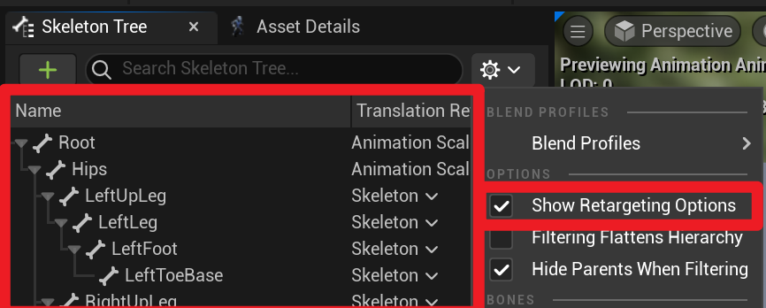
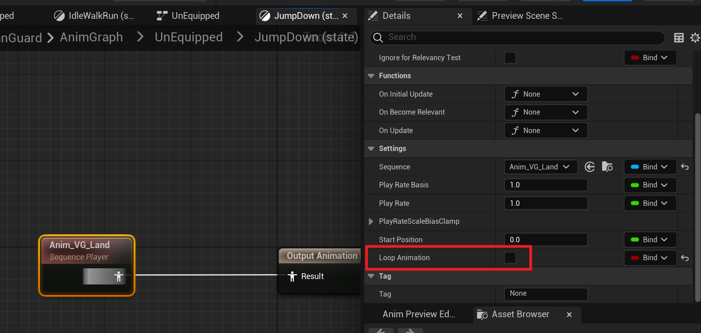
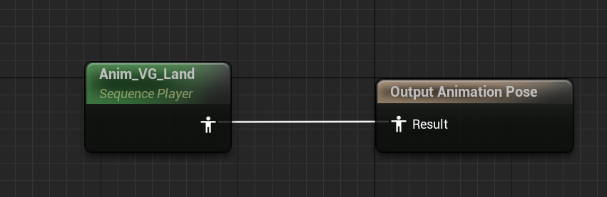
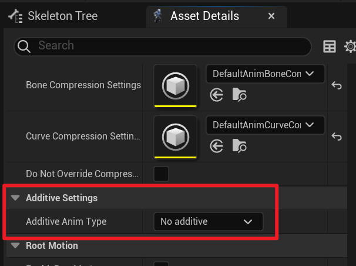
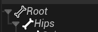
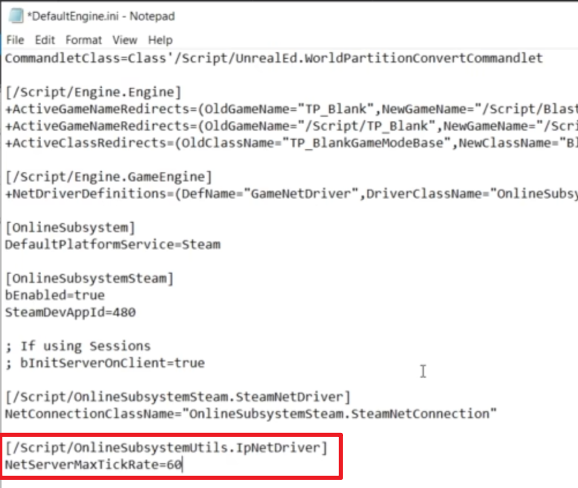
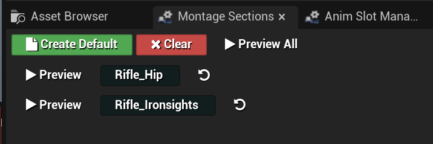
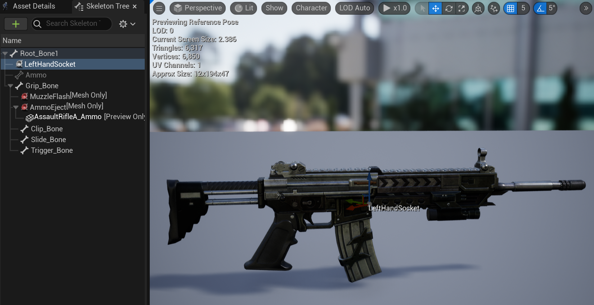
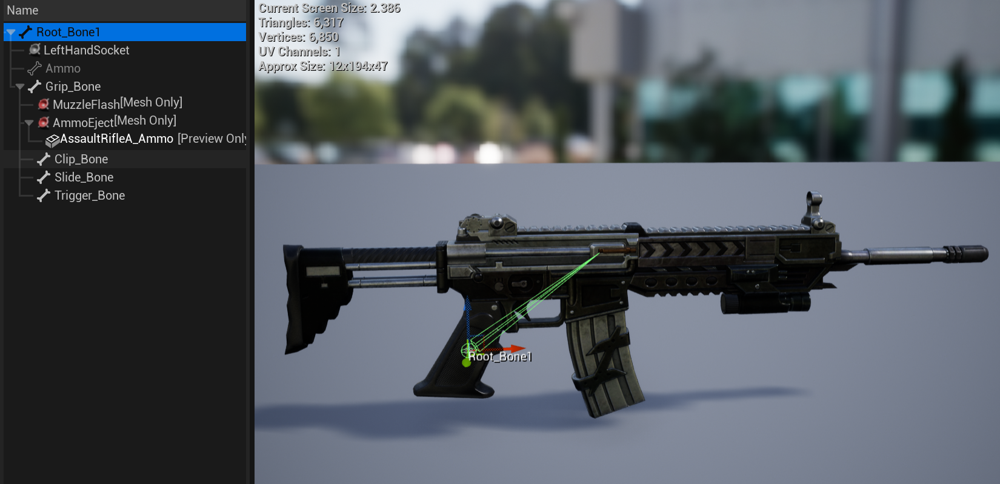
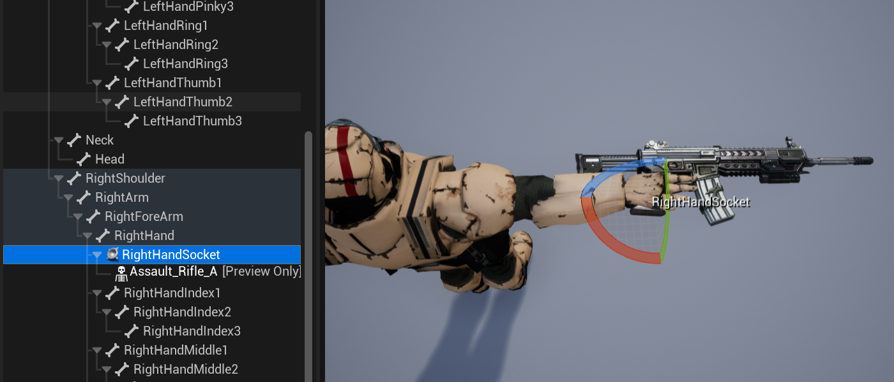

# 角色和动画 注意事项

## 角色3C

#### 摄像机

#### CharacterMovement

##### AirControl

空中移动能力 0无法移动，1 MaxWalkSpeed


## 动画

### 导入动画

从Mixamo或者其他网站上下载模型，并导入至UE

一般界面如下所示


默认勾选Skeletal Mesh和Import Mesh导入基本的Mesh文件，可以直接点击Import导入

导入后会自动产生以下几种资产，Physics Asset，Skeleton，Skeletal Mesh，以及材质文件和Texture贴图，Specular反射度贴图

之后以同种方式导入fbx动画，这次不需要勾选ImportMesh

### 动画问题

#### root骨骼

在进行动画骨骼重定向时时常会出现，一方有root骨骼有IK Solver而一方没有

在这种情况下将有ik的动画重定向至没有ik例如UE5小人动画导出给一个mixamo上下的没有root的骨骼时，很容易出现UE5小人的动画有root motion，而由于mixamo上的小人没有root，启用root motion或者force root lock导致hips骨骼不动。

解决如下，一种是利用python脚本前去maya中自行解决，

另一种是自行解决（

---

另外将没有root的角色动画转给有root的角色时，如果也遇到了hips或者pelvis的问题可以试着去动画资产文件中，将Skeleton Tree窗口Show Retargeting Options，右键Root 骨骼 选择Recursively Set Translation Retarget Skeleton，并将Root和Hips/Pelvis的重定向选择设置成Animation Scaled



---

#### animation loop

在混合动画状态机时，如果遇到动画重复播放问题，需要注意动画是不是启用了Loop Animation



#### animation sequence和animation sequence additive

在连接动画状态机时如果发现Sequence Player变成了绿色的，或者某一动画重定向时正确，导出后姿势倒地（旋转角度多了）**导致最终效果不是你所期望的**，可以去看看是不是动画资产变成了Sequence Player Additive



这时可以去检查下动画资产的asset details中 Additive Setting中Additive Anim Type是否是支撑了No Additive



#### excluded Bones

同时，在进行ik绑定时，需要注意是否将Root骨骼剔除于ik solver之外


骨骼旁边的小icon显示了如果是实心，则是被包含于solve之内，否则则是被excluded的



如果root骨骼不被剔除于solve的话将会出现一些奇怪的动画表现，比如说跑步的时候人物的胯部扭得异常起劲，又或者如图所示等root骨骼动画表现出了问题


#### NetUpdateFrequency && NetServerMaxTickRate

MinNetUpdateFrequency




####  BlendSpace Sample Smoothing平滑过渡

Weight Speed

Smooth

#### AnimMontageLoop



## 动画实现

### 武器双手位置矫正

一般例如步枪这种双手武器在武器的骨骼中会有一个插槽socket（"LeftHandSocket"）用来标记左手应该放置的位置



而右手（主手）的位置常见的则是默认的Root骨骼位置



而我们人物身上通常有一个插槽socket（"RightHandSocket"）用来标记武器应该放置于右手的何处



我们常见的处理方法是将武器绑定在人物右手骨骼上的`RightHandSocket`，然后通过微调socket的location和rotation校准武器的姿态位置，确保右手和武器的交互姿态正常。我们可以将武器骨骼空间上的`LeftHandSocket`的Transform信息转换到人物骨骼空间得到一个新的相对位置和旋转，这样我们就知道了在右手和武器没问题的情况下，我们的左手应该放置于何处——武器的`LeftHandSocket`的位置。同样的，通过微调socket的location和rotation，可以保证左手和武器的交互姿态正常。这样我们就实现了一个初步的双手位置矫正

## 源码剖析

#### UKismetMathLibrary::MakeRotFromX(const FVector& X)

此方法常用于人物/相机/飞行控制器之类根据移动方向调整朝向

```c++
KISMET_MATH_FORCEINLINE
FRotator UKismetMathLibrary::MakeRotFromX(const FVector& X)
{
	return FRotationMatrix::MakeFromX(X).Rotator();
}
```

可知直接调用的是FRotationMatrix::MakeFromX的函数，继续跳转

```c++
template<typename T>
TMatrix<T> TRotationMatrix<T>::MakeFromX(TVector<T> const& XAxis)
{
    // 归一化给定轴向量
	TVector<T> const NewX = XAxis.GetSafeNormal();

	// try to use up if possible
	TVector<T> const UpVector = (FMath::Abs(NewX.Z) < (1.f - UE_KINDA_SMALL_NUMBER)) ? TVector<T>(0, 0, 1.f) : TVector<T>(1.f, 0, 0);
    // FMath::Abs(NewX.Z) < (1.f - UE_KINDA_SMALL_NUMBER)
    // 如果给定轴向量的Z值绝对值 >= (1.f - UE_KINDA_SMALL_NUMBER)
    // 说明Z值接近于±1，即说明给定轴方向大体向上，靠近空间坐标系Z轴方向
    // 此时直接将upVector设置为空间坐标系X轴方向
    // 否则（给定轴并非尤其垂直）则将UpVector设置成空间坐标系Z轴方向

    
    //叉乘求出剩下两轴向量
	const TVector<T> NewY = (UpVector ^ NewX).GetSafeNormal();
	const TVector<T> NewZ = NewX ^ NewY;

	return TMatrix<T>(NewX, NewY, NewZ, TVector<T>::ZeroVector);
}
```

图示：


橙色即为给定轴，此时给定轴向量Z值接近于±1，默认将X轴设置为UpVector


补充：其中涉及到了^运算符，经跳转

```c++
template<typename T>
FORCEINLINE TVector<T> TVector<T>::operator^(const TVector<T>& V) const
{
    return TVector<T>
        (
        Y * V.Z - Z * V.Y,
        Z * V.X - X * V.Z,
        X * V.Y - Y * V.X
        );
}
```

易知即为叉乘运算


使用场景示例：

```c++
// 假设我们有一个角色类，它有一个 USkeletalMeshComponent 类型的成员变量 Mesh，用来表示角色模型
// 假设我们有一个 FVector 类型的成员变量 Velocity，用来表示角色运动速度
// 假设我们有一个 FRotator 类型的成员变量 Rotation，用来表示角色旋转角度
// 假设我们有一个函数 UpdateRotation，用来根据运动速度更新角色旋转角度

void ACharacter::UpdateRotation()
{
    // 根据运动速度向量计算旋转器
    Rotation = UKismetMathLibrary::MakeRotFromX(Velocity);
    // 设置角色模型的旋转角度
    Mesh->SetWorldRotation(Rotation);
}
-----------------------------------------------------------------------------------
// 假设我们有一个相机类，它有一个 UCameraComponent 类型的成员变量 Camera，用来表示相机组件
// 假设我们有一个 AActor 类型的成员变量 Target，用来表示目标物体
// 假设我们有一个 FRotator 类型的成员变量 CameraRotation，用来表示相机的旋转角度
// 假设我们有一个函数 UpdateCameraRotation，用来根据目标物体位置更新相机的旋转角度

void ACamera::UpdateCameraRotation()
{
    // 获取目标物体位置
    FVector TargetLocation = Target->GetActorLocation();
    // 获取相机位置
    FVector CameraLocation = Camera->GetComponentLocation();
    // 计算目标物体位置和相机位置之间的向量
    FVector Direction = TargetLocation - CameraLocation;
    // 根据向量计算旋转器
    CameraRotation = UKismetMathLibrary::MakeRotFromX(Direction);
    // 设置相机组件的旋转角度
    Camera->SetWorldRotation(CameraRotation);
}

```


### Aim
